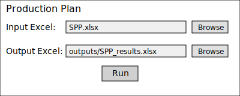

# production-plan

## Setup

1. Ensure Python 3.11 or newer is installed.
2. (Optional) Create and activate a virtual environment:
   ```bash
   python -m venv .venv
   source .venv/bin/activate
   ```
3. Install the required packages:
   ```bash
   pip install pandas numpy openpyxl
   ```

## GUI

Launch the Tkinter interface with:

```bash
python gui.py
```

Choose the input Excel workbook (defaults to `SPP.xlsx`), select an output location and click **Run**.

Example window:



## CLI

Run the transformations directly from the command line:

```bash
python main.py
```

The script reads `SPP.xlsx` and writes results to `outputs/SPP_results.xlsx`.
To specify custom paths:

```bash
python -c "from main import main; main({'input_xlsx': 'my_input.xlsx', 'output_xlsx': 'outputs/my_results.xlsx'})"
```
